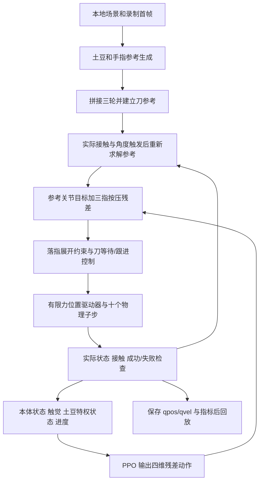

# 土豆连续切菜倒手 V1：设计、实现与开发交接

记录日期：2026-09-18。**已认可的行为基线：`4b1928ed3c3810c79c2c1e97ce57acf71ef905e6`**，提交标题为 `feat(sim): establish hand-first continuous chopping baseline`。用户看过交互回放后，将其认可为比较满意的第一版。本文件整理该版本的设计与证据，不引入新的动作或 RL 改动。

这是接手开发的主文档。[逐次试验记录](../../../tutorials/potato_tactile.md) 保留历史过程；[最初总体方案](../../superpowers/specs/2026-09-18-potato-tactile-regrasp-design.md) 是早期目标，不能当成全部已实现。代码行为以本基线为准。

配套 [复现清单与实测摘要](evidence/potato-regrasp-v1.json) 记录 Python/包版本、39 个场景依赖资产、初始录制、PPO 权重的 SHA-256，以及已保存的三轮实际动力学结果。它保存证据摘要与文件身份，不包含大型资产和策略文件本身。

## 阅读路线

- 首次接手：先读第 1–4 节，理解任务、复现方法和执行链。
- 修改动作：读第 5–6、9 节，尤其是接触点、腕部、PIP/DIP 与刀的相互约束。
- 后续讨论 RL：读第 7–8 节，区分策略输入、规则控制和仿真真值。
- 验证改动：读第 10–12 节，使用独立输出目录和相同条件比较。

## 1. 任务与已认可的行为

这里的“倒手”是扶持食材的左手逐步后退，不是把土豆从一只手交给另一只手。右手持刀，左手食指、中指、无名指弯曲扶持土豆。

认可的顺序是：

1. 三根主指扣住同一片接触区域；指尖参考位置固定，手腕分三次小幅后退，同时刀做对应的下刀/提刀展示。
2. 三次支撑完成后，等待三根中节指骨接近竖直且指尖接触稳定。
3. 三指同步屈曲腾空、后移、展开落下；不逐指依次移动。左腕在落指阶段允许轻微后移，保持参考朝向，不拧腕。
4. 在整个移指和落稳等待期间，刀保持前后位置，不随暂时向前突出的关节反向退开，也不抢先推进。
5. 左手三指重新接触并稳定后，刀再平滑向倒手方向跟进，然后继续下一轮。
6. 在同一动力学回合内做三轮；不在轮间重置土豆，共九次支撑下刀、三次移指。指尖每轮参考后移 8 mm。

已明确的约束：拇指、小指暂时移开；土豆底部削平一小块；不用测试外力；保留旧版本；刀只在初始化时从远处靠近。最后一点与“先手后刀”并不矛盾：左手先走会使间隙暂时增加，但刀自身不反向远离。

三指同时腾空且辅助指移开时，本设计不保证存在持续的手部夹持；土豆仍依赖平底与砧板的支撑、摩擦。无外力下完成移指，不能等同于在该阶段具备抵抗刀具冲击的力闭合能力。

**实现边界：** 这是自由刚体土豆上的连续扶持/移指仿真。土豆没有软组织、切割断裂或真实切片；刀的展示行程停止在土豆上方，不产生实际切入冲击。“按稳”由物理接触及物体运动指标判断，不是从动画外观推断。当前整体系统由参考轨迹、条件控制和残差 PPO 共同构成，不能称为从零学得的完整倒手策略。

## 2. 最短复现方法与依赖

### 2.1 Git 中有哪些，哪些必须另外保存

| 内容 | 位置/身份 | 是否随本基线提交 |
|---|---|---|
| 动作生成、动力学环境、CLI、测试、教程 | 仓库源码 | 是 |
| 场景与机器人/刀/手模型 | `local/assets/robot_assets/` | 否 |
| 场景引用的机械臂网格 | `local/assets/MarvinCCS/` | 否 |
| 初始姿态录制 | `local/data/recordings/recorded_hand_guarded_chop_200hz_latest.npz` | 否 |
| 当前使用的权重 | `local/outputs/potato/dynamic_regrasp_angle_gate/policy.zip` | 否 |
| 训练元数据 | 同上目录 `training.json` | 否；摘要已收入证据 JSON |
| 已认可的视频与轨迹 | `local/outputs/potato/dynamic_regrasp_hand_first/` | 否；指标及哈希摘要已收入证据 JSON |
| 旧试验源码快照 | `local/checkpoints/` | 否 |

`.gitignore` 忽略 `local/`、`.venv/`、NPZ 和 ZIP 等。因此 **仅 clone/checkout Git 不能完整复现这一版**。需恢复本地资源，参见 [本地资源清单](../../../manifests/local-assets.yaml)。不要从文件名中的 `latest` 判断录制是否相同，核对 SHA-256。

路径解析由 `robot_core.paths` 负责，可以设置 `COOKING_LOCAL_ROOT` 指向另一个资源根目录。此时源码会重定向场景和初始录制；下方 CLI 中显式写出的 `--policy`、`--output` 路径仍需相应修改，不会自动替换命令文本中的 `local/`。

### 2.2 环境

实测使用 Linux、Python 3.12.7、MuJoCo 3.10.0、NumPy 2.5.3、Gymnasium 1.3.0、Stable-Baselines3 2.9.0、CPU PyTorch 2.14.0+cpu；视频使用 imageio 2.37.4、imageio-ffmpeg 0.6.0、Pillow 12.3.0。这些是本机实测版本，项目依赖中的范围并不是严格锁文件。

全部命令从仓库根目录运行。已有 `.venv` 时不必重建；新环境参见 [安装教程](../../../tutorials/environment_setup.md)。在基础项目环境之上还需要 potato 可选依赖及渲染依赖，例如：

```bash
# 尚无环境时先执行；会创建本机虚拟环境并安装项目各包。
./scripts/setup/create_env.sh
# 当前原型使用 CPU torch；此命令会访问包服务器。
.venv/bin/python -m pip install torch --index-url https://download.pytorch.org/whl/cpu
.venv/bin/python -m pip install -e '.[potato]' Pillow
```

新机器安装后先比对证据清单中的版本与资源身份，再比较仿真结果；不要复制别人的 `.venv`。本次文档整理没有重装环境，也没有验证全新机器安装。

### 2.3 固定运行配方

CLI 默认值不是认可版本，必须保留下列完整参数。为了保护已认可的输出，复现写入新目录：

```bash
OMP_NUM_THREADS=1 .venv/bin/python scripts/simulation/run_dynamic_regrasp.py \
  --policy local/outputs/potato/dynamic_regrasp_angle_gate/policy.zip \
  --cycles 3 \
  --wrist-retreat-mm 4 \
  --smooth-regrasp --angle-threshold-deg 80 \
  --curl-release --landing-wrist-retreat-mm 4 --early-pip-curl \
  --support-repeats 3 --regrasp-speed 1.6 \
  --knife-gap-mm 7 --cut-depth-mm 24 \
  --continuous-knife --no-knife-reverse --hand-first-knife \
  --output local/outputs/potato/v1_reproduction
```

- 不加 `--view/--export`：只评估和保存数据，不需要显示器。
- 查看：在同一命令末尾加 `--view`，图形桌面环境可能需设置 `DISPLAY=:0`。
- 导出：在同一命令末尾加 `--export`；无桌面渲染可在命令前设置 `MUJOCO_GL=egl`，需要可用的 EGL 驱动。
- 两项都加时先评估、再导出、最后打开 Viewer，因此窗口不会立即出现。
- 空格暂停/继续，1/2/3 切换视角。Viewer 按 0.5 倍物理时间播放；MP4 为 25 fps，每两个 20 ms 物理记录采样一帧，按物理时间播放。`--regrasp-speed 1.6` 改的是动作参考时钟，不是视频播放倍速。
- 有 `--policy` 时脚本依次运行零残差 `reference` 和 `PPO`，`evaluation.json` 包含两者；保存的轨迹/视频是最后的 PPO 回合。没有 `--policy` 时是零残差对照，不是已有 PPO 的等价复现。
- 这轮只整理文档，不执行 `--train`。已有权重缺失时，重新短训不能保证复现同一结果。

### 2.4 检查资源是否一致

下面是只读核验，不恢复或覆盖任何文件。清单中的资产路径以仓库根目录为基准，`COOKING_LOCAL_ROOT` 另设时需调整路径映射。

```bash
.venv/bin/python - <<'PY'
import hashlib, json
from pathlib import Path
m = json.loads(Path('docs/agent/simulation/evidence/potato-regrasp-v1.json').read_text())
for item in [m['policy'], m['initial_recording'], *m['asset_dependencies']]:
    path = Path(item['path'])
    assert path.is_file(), f'Missing: {path}'
    assert hashlib.sha256(path.read_bytes()).hexdigest() == item['sha256'], f'Changed: {path}'
print('Policy, initial recording and all scene asset dependencies match V1.')
PY
```

## 3. 场景、尺度与数据来源

### 3.1 场景构成

复用 Tianji 双臂、Wuji 左手、砧板和右手刀场景。生成土豆时移除独立抓放实验的 `pick_*` 物体/底座，避免它们干扰当前接触。

| 参数 | V1 实际设置 |
|---|---|
| 土豆生成方式 | 程序采样的不规则凸网格；视觉和碰撞共用该网格 |
| 标称半径 X/Y/Z | 40 / 65 / 30 mm；长轴沿 Y |
| 标称完整尺寸 | 80 × 130 × 60 mm，非每个轴上的精确网格包围盒值 |
| 底部 | 从原最低点向上 3 mm 截平；总高约 57.1 mm，历史几何测量底面约 40.2 × 65.4 mm |
| 质量 | 剩余土豆按 0.22 kg 设置 |
| 摩擦字段 | 土豆 geom：`0.65 0.005 0.0001`，`condim=6`；砧板另有自身参数，不能把单个 geom 系数当作所有接触对的实测摩擦 |
| 自由度 | `potato_free` 自由关节，没有焊接、位置回正或隐藏抓持 |
| 砧板上表面 | 世界 Z = 0.230 m；土豆初始高度按削平网格最低点计算 |
| 积分 | 2 ms 物理步长，`implicitfast`，重力 -9.81 m/s² |
| 外力 | 动态 CLI 固定 `disturbance=False`；V1 无测试推力 |
| 形状随机化 | 无；当前配置 `shape_seed=0`，形状固定 |

历史尺度检查约为掌长宽 105 × 81 mm、整手伸展长 206 mm；当时未发现单位缩放错误。后来选择更大、长轴沿切片方向的土豆，手模型不缩放。这些尺度检查是历史几何证据，不是手模型的人体标定。

指尖当前主要是球形指腹代理（半径约 11 mm）；**没有独立指甲接触几何**。“扣住”描述动作意图，不等于仿真已经实现硬指甲嵌入/挂住土豆。

### 3.2 录制和用户示范分别贡献了什么

早期检查发现原项目有 MCAP 手势与经加工的护手切菜 NPZ。总体方案记载原 MCAP 含 499 条 `/joint_states`、约 4.15 秒，没有触觉字段；生成的 `recorded_hand_guarded_chop_200hz_latest.npz` 含 831 帧左右臂各 7 维、手部 20 维目标。这不是“已验证稳定接触的专家演示”。

**当前 `build_finger_regrasp_preview()` 只取该 NPZ 三个关节目标数组的第 0 帧初始化双臂与手。** 然后重新设置三指、摆放手掌、求土豆表面接触，再由程序生成后续整段动作；没有把 831 帧整段作为当前倒手动作，也没有行为克隆或视频动作提取。

用户图片与持续文字反馈确定了动作语义。早期记录中 YouTube/B 站视频未成功取得内容（B 站返回 412）；不能声称已从这些视频重建轨迹。参考链接仅作为需求背景保留：

- https://www.youtube.com/watch?v=aYCzAgbXhrY
- https://www.bilibili.com/video/BV17E411B7Jh/

### 3.3 坐标和关节约定

- 世界 **+Y 是左手倒手/后退方向**，-Y 是向刀侧“前探”；+Z 向上。刀在左手完成后也沿 +Y 跟进。不要仅凭画面左右判断正负号。
- 指序 1/2/3/4/5 = 拇指/食指/中指/无名指/小指。
- 每指 joint1 为 MCP 屈伸，joint2 为侧摆，joint3 为 PIP，joint4 为 DIP；PIP/DIP 正向增大对应当前模型的屈曲。
- “中节指骨角度”测量 joint3→joint4 两个实际关节锚点连线与水平面的角度：`atan2(abs(v_z), norm(v_xy))`，90°为竖直。它不是单个 PIP 关节角，也不能与旧的中节倾角约束数值混用。

## 4. 软件结构与执行链

| 文件/入口 | 作用 | 接手时的注意事项 |
|---|---|---|
| `packages/cooking_simulation/src/twin_sim/potato_contact.py` | 土豆配置、网格、场景拼装、接触聚合 | `PotatoConfig` 默认是旧尺寸；动态任务另传 V1 尺寸和平底 |
| `.../finger_regrasp.py` | `FingerSolver` 和离线手指参考轨迹 | 可以直接设置规划用 data 的 qpos；本模块的几何预览不证明动力学成功 |
| `.../dynamic_regrasp.py` | 连续参考、刀参考、`DynamicRegraspEnv`、触发逻辑、残差动作、奖励和指标 | V1 的真实执行入口 |
| `.../kinematics.py` | 手臂 FK/IK | V1 持刀 IK 要以上一步控制姿态作种子，避免冗余姿态跳变 |
| `.../pip_guard.py` | 早期 PIP 前探补偿实验 | 代码保留，V1 不启用 `--pip-guard` |
| `scripts/simulation/run_dynamic_regrasp.py` | 训练/评估入口、保存回合、导出、Viewer | 每次先运行物理回合，窗口和视频再播放记录 |
| `scripts/simulation/view_finger_regrasp.py` | 早期几何预览 | 默认动作含历史辅助指逻辑，不能替代 V1 演示 |
| `.../potato_env.py`、`.../potato_cli.py` | 第一阶段录制参考 RL 原型 | 与 V1 动态环境不同，不能混用训练结论或 CLI 参数 |
| `tests/simulation/test_*regrasp.py` 等 | 几何/动力学/时序回归 | 具体覆盖见第 10 节 |



`reset()` 写初始 qpos，并执行 500 个物理步（1 秒）稳定接触，再记录土豆基准位置/姿态并将时间归零。正常 `step()` 每 20 ms 更新控制，调用十次 `mj_step`，不把真实土豆或手关节重设到参考轨迹。轮间也不 reset。

规划、IK、几何检查使用独立 scratch data，回放使用记录的 qpos/qvel 恢复画面；这两处允许写 qpos，与正常动力学 step 的约束不同。不要把“回放播放器设状态”和“仿真执行强行固定物体”混为一谈。

当前 34 个受控关节 = 左臂 7 + 右臂 7 + 左手 20。使用有限力位置驱动器；开启 `curl_release` 后三根主指的驱动刚度乘 2.5、阻尼乘 √2.5，保留原力矩限制。参考轨迹准确、实际接触跟踪准确是两件事。

## 5. 左手动作设计和状态流程

### 5.1 接触点与腕部位置

初始接触区域相对旧动作沿 +Y 移 24 mm，接近土豆顶部，减少从斜侧面向后推物体。手掌同时移动以保持可达；只移指尖、固定原手掌会造成 IK 不可达。每一轮的基准接触区域再后移 8 mm。

每处三次支撑中，腕部总后移 4 mm；移指结束的落指阶段另允许后移 4 mm。两段合计 8 mm，与下一轮接触点间距相配，减少轮间姿态倒退。第二、三轮初始掌高的规划偏移为 17 mm，第一轮为 16 mm；这些是相对录制初始摆位的偏移，不是距桌面的绝对高度。

### 5.2 连续移指曲线

三指共享一个进度 `u ∈ [0,1]`：

- 水平与接触端点插值：`s = u³(10 − 15u + 6u²)`。
- 腾空：在接触点插值上叠加 `12 mm × sin²(π × lift_u)`。
- 加强早期 PIP 配合：前半程 `lift_u = u + 0.12 sin²(2πu)`，后半程为 `u`；不加高最大抬指高度，也不改变落点。
- DIP 参考：由起始角平滑过渡到 30°，途中叠加 `24° × sin²(πu)`，形成先屈曲腾空、再展开落下。
- `TRIO_LIFT / TRIO_RETREAT / TRIO_PLACE` 是同一连续曲线的三个显示区间，并非三个停车后拼接的动作。

`FingerSolver` 约束指尖位置，按场景追加 PIP 领先量、中节倾角或 DIP 角约束；使用阻尼雅可比更新、限位和线搜索。位置目标可达不代表无滑移，仍需实际动力学检查。

### 5.3 实际执行的阶段

| 阶段 | 行为与条件 |
|---|---|
| `INITIAL_APPROACH` | 只出现一次，刀从前方约 35 mm、上方约 25 mm 偏移平滑靠近；50 个参考采样 |
| `HOLD` | 初始支撑保持 |
| `CUT_ADVANCE` | 三次支撑退腕，每次 40 个移动采样 + 20 个保持采样；指尖世界参考固定，刀对应做三次浅行程 |
| `ANGLE_GATE` | 若三次已完成，三根中节实际角度均 ≥80°且三指对土豆载荷均 >0.1 N，持续 60 ms，才放行；否则等，超过 5 秒失败 |
| `KNUCKLE_BACK` | 历史标签；V1 退腕模式下主要用于过渡/保持，不是再做一次额外大幅退腕 |
| `TRIO_LIFT/RETREAT/PLACE` | 三指连续同步移指；本段参考时钟额外乘 1.6；刀保持前后目标 |
| `HOLD_END` 第一部分 | 左手到落点，冻结参考时钟等待落稳；满足接触条件后右手跟进 |
| `HOLD_END` 后续 | 刀目标达到近距间隙后恢复参考时钟，完成该轮稳定检查 |
| `WRIST_FOLLOW` | 连续接到下一轮；重复支撑模式从上一轮实际控制目标开始平滑衔接 |

V1 删除中途 `KNIFE_CLEAR` 和轮间独立 `KNIFE_APPROACH`。辅助指始终停在脱离位置，与之相关的历史等待阶段也移除。

角度触发时保存的是腕部**控制目标**，不是把腕部真实状态焊死。因为可能提前触发，`_retarget_fingers_for_held_wrist()` 会按照该腕部目标重新求后续指尖/DIP 与刀参考。继续使用原来“退满行程后的手形”会使后续接触错位。

重复支撑模式在 `TRIO_PLACE/HOLD_END` 对 PIP/DIP 控制目标施加只能展开或保持的限制，同时参考实际关节角反馈；进入下一轮准备时允许正常几何调整。该限制不等于真实 PIP/DIP 完全没有动态回弹，也不代表 MCP 已实现理想的轻微伸展。

## 6. 右手刀：不反退，并等左手完成

### 6.1 为什么不再强求全程恒定 3 mm

旧版近距跟随每步根据手指包络调整刀的位置。起指屈曲时，关节轮廓会暂时向前突出；要保持恒定 3 mm，刀就被迫沿 -Y 反退约 5 mm。用户看到的反退不是土豆自动移动，而是刀的跟随控制结果。

V1 目标间隙采用 7 mm，为这段关节轮廓变化预留空间。初始化后刀的世界 Y 目标单调不减。真实执行仍有跟踪误差，所以只报告实测的微小偏移，不宣称实际状态严格单调。

间隙是刀碰撞体与整组左手指碰撞几何的最近距离，不是理想 PIP 点到刀的距离。另记录 `knife_pip_gap_m`，专门针对三指 `link3_collision`。二者不要互换。

### 6.2 先手后刀的触发与推进

`--hand-first-knife` 要求同时开启 `--no-knife-reverse`，后者要求 `--continuous-knife`。

- 整个 `TRIO_*` 阶段及落稳前，保持刀前后目标；不是只在刚抬指时暂停。
- 在 `HOLD_END` 检查三指对土豆载荷各 >0.1 N、接触切向滑移速度各 <0.02 m/s、土豆平移速度 <0.02 m/s，连续三个 20 ms 控制步满足才允许刀动。
- 这些判断直接读取仿真接触及物体速度，包含接触对象身份，属于规则控制使用的真值；不是 PPO 输出的“已抓稳”判断。
- 允许后，刀沿 +Y 跟进，目标速度上限 20 mm/s，起步速度按 80 mm/s² 增长。现有实现限制起步和逐步推进，并非完整的双向加减速轨迹规划。
- 跟进完成由控制目标上的几何间隙判断：`gap <= desired_gap + 0.1 mm`。它不是刀手实测接触力伺服，也没有单独以实际刀姿跟踪误差作为完成条件；后续原有保持段仍执行。
- 手落稳等待及跟进总计超过 3 秒，终止为 `hand_knife_sequence_timeout`，不强行进入下一轮。

持刀 IK 从上一控制步的关节目标开始求解，避免相同末端目标对应不同冗余姿态造成跳变。刀的方向约束作用于工具 TCP 世界 Y；验收另外测量实际刀碰撞体中心，避免“命令没反退，刀身却退了”的假结论。

几何求解在方向边界处可接受小于设定目标但至少 0.5 mm 的预测间隙，否则报求解错误。**这只是命令可行性条件，不保证真实动态最小间隙**；实际每个物理子步仍检查刀手力。曾经出现预测可行、实际持刀臂姿态跳变碰手的候选，不能跳过真实执行验证。

刀下移参考为 24 mm 的周期浅行程；使用刀和土豆世界 Z 包围盒的保守分离间隙修正参考，避免切入整颗刚体土豆。负的刀食物间隙会被报告、相关测试要求其为正；当前运行时失败条件没有单列该间隙阈值，不能把它描述成独立的运行时安全联锁。

## 7. 触觉、本体与特权状态

### 7.1 80 维理想触觉

`hand_tactile()` 覆盖五个指腹 `pad`，再覆盖五个中节 `link3_collision`，顺序均为拇指到小指。每区八通道：法向载荷 1、局部合力 XYZ 3、局部接触中心 XYZ 3、接触标志 1。

接触力来自 `mj_contactForce`，按选定区域承受力的方向聚合；接触中心按法向载荷加权，再变换到该 body 局部坐标。无有效接触时置零。多点接触被汇总，不是逐 taxel 压力图；没有光学触觉图像、皮肤形变、噪声、延迟、滤波或历史堆叠。

策略触觉不包含接触对象 ID，汇总的是该区域所有有效接触；而诊断中的 `tip_loads_n`、`tip_slip_m_s` 专门筛选土豆接触。两套量用途不同，不能说落稳规则仅使用了策略的 80 维触觉。

### 7.2 策略 observation：169 维

| 键 | 维数 | 精确内容 |
|---|---:|---|
| `proprio` | 68 | 按 actuator 对应 qpos/dof 顺序的 34 个关节位置和速度 |
| `tactile` | 80 | 上述十个触觉区 |
| `privileged` | 16 | 固定半径 `[.04,.065,.03]`；土豆相对 reset 稳定后位置的位移 3；当前姿态四元数 4；自由关节速度 6 |
| `phase` | 5 | 参考时钟/总参考时长；三根实际中节角度/90；角度触发稳定累计时间/60 ms（最大为 1） |

土豆姿态输入为当前四元数，并非相对初始四元数；位移才是相对初始位置。半径是标称常数，不是实时表面点云。土豆和几何状态直接来自仿真，执行策略 actor 也能看到特权量，并非仅 critic 使用。

`phase` 不含完整阶段 one-hot、刀跟进等待标志、接触点历史或上一 action；最终新增的先手后刀状态没有扩展旧策略 observation。也没有相机、真实指尖传感器或腕部六维力传感器作为这一策略的输入。

## 8. 已有 RL：职责、动作、奖励与训练身份

### 8.1 权重训练历史

权重来自 `dynamic_regrasp_angle_gate/policy.zip`；训练元数据与 ZIP 中的计步一致，为 **PPO 16,384 步，seed 0**。`MultiInputPolicy`，网络 `[64,64]`，`n_steps=512`、`batch_size=128`、学习率 `3e-4`，CPU 执行。

训练时角度门槛记录为 85°，无外力、无形状随机化。后续 80°触发、三次支撑、屈曲/展开优化、刀不反退和先手后刀等变化沿用了该权重，**没有针对最终 V1 再训练**。最终对照结果属于旧策略在新控制流程中的复用，不是最终流程重新训练后收敛的证据。

### 8.2 四维 action

`a ∈ [-1,1]^4`：前三维分别控制食指、中指、无名指的竖直按压残差，第四维控制共享参考时钟。

按压方向为世界 -Z，先用参考手形的指尖雅可比把名义 3 mm 位移映射成关节修正；单个映射列按最大关节偏移 0.12 rad 缩放。控制为 `clip(reference + directions @ a[:3], actuator_limits)`，并应用落指展开约束。它是有界位置残差，不是直接牛顿值，也不是精确力控制。

每控制步参考时钟增加：`0.02 × phase_speed × (1 + 0.3*a[3])`。`phase_speed` 只在 `TRIO_*` 为 1.6，其余为 1；显式角度/接触门控可以暂停时钟或跳转到后续参考阶段，PPO 不能越过门控。

PPO 不能独立选择倒手阶段、输出刀动作、改变三个接触点位置、决定腕部轨迹或指挥拇指小指。主要动作结构仍由参考与规则决定。

### 8.3 当前环境的 reward

下式描述 V1 代码中的奖励，不能据此假定早期权重训练时的全部流程与 V1 一样：

```text
r = Δreference_clock / 0.02
    - 60 * potato_displacement_m
    - 4 * norm(potato_linear_velocity_m_s)
    - 3 * sum(five_tip_slip_m_s)
    - 0.2 * norm(sum(tip_forces_on_potato) 的 XY 分量)
    - 0.02 * potato_rotation_deg
    + 0.1 * sum(min(required_tip_loads_n, 1))
    - 0.03 * sum(max(five_tip_loads_n - 3, 0))
    - 0.02 * sum((action - previous_action)^2)
```

在 `TRIO_LIFT/TRIO_RETREAT` 不要求三主指支撑，其他阶段接触奖励使用三主指；接触奖励在每指 1 N 封顶。滑移、水平力和载荷来自实际土豆接触真值，策略不一定直接观测到这些奖励量。旋转惩罚用相对 reset 姿态的四元数夹角，单位为度。

每轮检查满足稳定条件额外 +5，否则 -5；运行失败再 -30。进度奖励使用本步实际参考进度：冻结等待时没有该奖励，角度触发跳转时按跳转量计算。当前没有材料切割质量奖励，也没有专门训练“何时让刀等待”的策略奖励。

### 8.4 成功、失败和证据边界

成功须完成全部轮次、无失败、全过程最大土豆位移 <5 mm，并且每轮结束时三指土豆接触载荷均 >0.1 N、土豆线速度 <0.02 m/s。`termination_reason=complete` 只表示流程走完，必须另看 `is_success` 和 `cycle_checks`。

运行失败条件包括角度等待 >5 秒、先手后刀序列等待 >3 秒、非有限状态、土豆位移 >40 mm、土豆接触穿透 >4 mm、刀手接触力 >0.5 N。用尽 `max_steps` 则标记 truncated/timeout。失败阈值比稳定成功阈值宽，不能把“没触发失败”当作稳定。

当前已看到 PPO 对单一场景的稳定性改善，但没有做公平触觉消融，不能证明策略主要依赖触觉；没有跨形状、跨摩擦、跨初始姿态或真实切割扰动验证。仅改无扰动环境的 seed 不会产生独立的泛化测试。

## 9. 关键困难、试过什么、为什么这样定下来

以下区分已验证改动、历史诊断和未完成事项。具体逐版数值和命令保留在演进教程中，不能跨版本直接排成同条件性能榜。

| 问题/用户反馈 | 诊断或尝试 | 最终处理与取舍 |
|---|---|---|
| 手显得比土豆大 | 核对实际尺寸，没有发现单位缩放错 | 手不缩放，土豆改为标称 130 mm 长；形状不是扫描资产 |
| 三指应一起移动 | 逐指预览不符合任务 | 共享一条三指同步轨迹，取消逐指交替方案 |
| 拇指小指越扶越把土豆推走 | 辅助侧向接触可能制造反向作用力 | 两指全程停在离开位置，碰撞仍开；不增加隐藏支撑 |
| 土豆往后移动，不清楚来自哪里 | 原型有主动扰动，侧面按压也产生水平分力 | 按用户要求关闭外力；削平 3 mm；接触点向顶部移 24 mm，残差改竖直向下，另记录水平合力 |
| 明明参考“固定指尖”，实际仍滑 | 几何接触可达不等于有限力伺服能跟踪 | 分离几何与实际物理验证；记录载荷/滑移/物体位移，保留驱动力限制 |
| 关节在抬指前先前探 | 曾用左臂和三指联合约束 PIP 位置 | `pip_guard` 减少了前探，却出现用户不接受的拧腕；撤回为可选实验，V1 不启用 |
| 整手只是移指，没有持续退腕感 | 用户指出固定指尖阶段应让腕部后退 | 分成固定指尖退腕和随后移指；按实际角度门控，腕朝向参考保持 |
| 太晚触发且动作像硬拼接 | 85°阈值和分段轨迹/停顿影响观感 | 认可版阈值改 80°；使用五次插值与连续腾空弧线，保留阶段名作为观察标签 |
| 到新点后还重新屈曲 DIP/PIP | 只约束指尖不足；轮间又回到旧深屈曲种子，曾出现 40–59°主动回卷 | 起始与落点 DIP 统一为 30°；离开时加 24°屈曲拱形；落指阶段限制目标继续屈曲；不宣称真实状态绝对无回弹 |
| 落指仍有回弹，起步 PIP 屈曲不足 | 固定腕几何使手指补偿；单纯加落点屈曲会违背用户要求 | 落指腕后移最多 4 mm；只提前前半程腾空参数加强 PIP，不在落点再收紧 |
| 每次固定位置只退一下 | 角度很早满足就直接放行 | 每位置明确要求三次支撑；总退腕 4 mm，三次做完仍要通过角度/接触门控 |
| 下一轮开头指尖滑动明显 | 从离线旧终点拼下一轮，与重定向后的真实控制终点不一致 | `WRIST_FOLLOW` 从上一实际控制目标平滑衔接；重复支撑模式不把落指展开限制错误延续到整个下一轮 |
| 刀每轮远离，再靠回，切菜不连贯 | 旧 `KNIFE_CLEAR/KNIFE_APPROACH` 就是显式避让 | 加 `continuous_knife`，仅初始化远处靠近；保留真实碰撞检查 |
| 起指时刀反向退约 5 mm | 固定 3 mm 间隙跟踪了屈指时前突的关节包络 | 采用 7 mm 目标间隙和单向目标约束，允许阶段间隙变化 |
| 直接锁刀/提前退腕的候选碰手 | 试过把落指的 4 mm 腕后移提前到起指；几何候选失败或实际碰撞 | 撤销提前退腕，保留认可的左手轨迹；没有通过关碰撞解决 |
| 刀尖目标近乎不动，实际刀身却偏移 | 沿离线参考姿态重复求 IK，候选出现持刀臂姿态跳变；修正后实际检验通过 | IK 改为以上一控制目标为初值；同时比较实际刀身位移与接触，不能只看目标 |
| 希望左手先走完再推刀 | 只在 `TRIO_LIFT` 暂停，后两段刀仍跟随 | V1 冻结整个移指段刀前后目标，落稳接触确认后才限速跟进，暂停参考时钟完成等待 |
| 刀食物距离查询曾与碰撞/包围盒矛盾 | 原型发现某些网格距离返回负值不符合实际几何 | 刀食物参考使用保守世界 Z 包围盒间隙；刀手仍最近距离并检查实际物理步接触力 |

两个尤其应避免的回归：为减少 PIP 前探而自由拧手腕；为消除落指回弹却在下一轮又把 DIP 插值回旧深屈曲起始形态。另不要为了让刀保持近距，重新引入用户已拒绝的反向退刀。

## 10. 当前验收证据与测试

### 10.1 已保存的最终回合

来源：`local/outputs/potato/dynamic_regrasp_hand_first/evaluation.json`、`hand_first_metrics.json`。同一固定形状、无外力、seed 100，PPO deterministic 推断。这里引用已有记录，文档整理未重新训练或扩大评估。

| 指标 | 零残差 reference | 已有 PPO |
|---|---:|---:|
| 完成轮数 | 3 | 3 |
| `is_success` | false | true |
| 土豆最大位移 | 8.375 mm | 3.255 mm |
| 刀手最大接触力 | 0 N | 0 N |
| 刀手最小间隙 | 2.759 mm | 3.004 mm |
| 刀食物最小 Z 间隙 | 2.793 mm | 2.630 mm |

PPO 三轮移指期间刀身前后幅度约 0.00844 / 0.00841 / 0.00823 mm；落稳后刀目标跟进约 0.30 / 0.30 / 0.28 秒。移指末尾间隙暂时增至约 10.5 mm。约 19.32 秒 MP4 包含整段三轮物理回放；Viewer 按半速循环显示。

PPO 与零残差的执行时长也可能不同，因为第四维 action 改变进度。因此此对照是整体控制器比较，不是仅比较同一轨迹速度下的按压力，也不是触觉因果证明。

### 10.2 指标文件的读法

- `evaluation.json`：两种控制器的最终汇总、每轮稳定检查、触发事件和实际刀手最大力。
- `rollout.npz`：`qpos`、`qvel`、`dt=0.02`；导出的是实际执行记录。循环播放重头开始不代表轮间重置。
- `rollout-metrics.json`：每控制步位移、载荷、滑移、关节/刀位置、角度、间隙、阶段、触发记录。
- `knife_follow_events`：允许刀跟进的时刻、当时三指载荷/滑移、刀目标跟到位的时刻。
- `hand_first_metrics.json`：已有回合的离线汇总，**不是 CLI 自动生成文件**；证据 JSON 已保存该汇总，后续可从逐帧位置和事件重新计算。
- `phase/cycle` 标签根据 step 更新后的参考时钟生成，而该物理步使用的是更新前参考；分析边界处允许一个控制采样的标签错位，不要把它当提前运动证据。
- `max_displacement_m` 为相对 reset 稳定后位置的累计峰值，轮间不归零。
- 指尖载荷/滑移通常是控制采样值；刀手力、土豆穿透和辅助指异常接触在物理子步也检查，避免遗漏短暂碰撞。

### 10.3 与本次基线直接相关的测试

提交 `4b1928e` 前实际运行下列组合：**12 passed，60.55 秒**。这些测试不加载 PPO 权重；策略结果另由上面的实际评估记录支持。

```bash
OMP_NUM_THREADS=1 .venv/bin/python -m pytest \
  tests/simulation/test_hand_first_knife.py \
  tests/simulation/test_knife_direction.py \
  tests/simulation/test_continuous_knife.py \
  tests/simulation/test_dynamic_regrasp.py -q
```

| 测试 | 验证内容 |
|---|---|
| `test_hand_first_knife.py` | 移指期间刀目标与实际刀身保持、落稳后跟进、速度界限、物理间隙；人为暂时屏蔽接触确认，检查轨迹结束也不能放行 |
| `test_knife_direction.py` | 目标不反退、实际刀身反向幅度受限、无刀手接触、完整倒手和 reset 状态清理 |
| `test_continuous_knife.py` | 仅一次初始化靠近，无中途远离阶段，连续近距动力学执行 |
| `test_dynamic_regrasp.py` | 有界动作、真实土豆速度积分、有限力驱动、接触、辅助指停放、默认无外力等；有些测试显式开扰动只验证底层能力 |

历史相关测试还包括 `test_repeated_support.py`、`test_curl_release.py`、`test_landing_wrist.py`、`test_early_pip_curl.py`、`test_wrist_then_fingers.py`、`test_smooth_regrasp.py`、`test_potato_contact.py`。修改对应机制后选择性运行；不能把这些早期参数下的几何测试通过等同于最终三轮 PPO 成功，也不要把其他仿真任务曾经全仓通过的数字套到本次变更上。

## 11. 保留版本、失败候选与恢复

| 身份 | 含义 |
|---|---|
| `4b1928e` | 用户认可的 V1，先手后刀，含不反退控制和测试 |
| `5cd8d85` | 前一提交，提速、刀初始化后持续近距；尚有起指反退现象 |
| `2364d98` | 更早已提交的三次支撑倒手版本 |
| `local/checkpoints/20260918-before-hand-first-knife/source.tar.gz` | 修改先手后刀前的源码快照；对应不反退但尚未完整等待左手的版本 |
| `local/checkpoints/20260918-landing-wrist-4mm-preserved/source-policy-results.tar.gz` | 早期落指退腕认可版的源码/策略/结果快照，仍依赖外部机器人资产 |
| `local/outputs/potato/dynamic_regrasp_no_knife_reverse/` | 上一版认可过的不反退回放 |
| `local/outputs/potato/dynamic_regrasp_hand_first/` | 最终 V1 回放；不要拿新的试验覆盖它 |

`no_knife_reverse_probe/assist/early/hold/gap4/gap5/gap7/all` 等名字相近的试验目录中有失败候选，不能凭“更大间隙”或目录排序认作最终结果。最终不反退版本包含“上一控制姿态作为 IK 种子”修正，最终先手后刀还包含完整移指等待及落稳确认。

恢复时优先使用提交身份和独立工作目录，不对有改动的工作树直接 reset。可以先用 `git show 4b1928e:path/to/file` 查看历史源码；归档先 `tar -tzf` 检查内容，再解压到新目录。任一源码恢复都还需对应的本地资产、初始录制、策略和运行参数，不能只恢复一个 Python 文件就声称恢复完整实验。

## 12. 后续开发的边界与排查入口

目前未解决：独立指甲接触、真实切割/刀具冲击、柔性皮肤/土豆、真实传感器噪声延迟、不同形状和摩擦泛化、触觉消融、从反馈学习完整动作时序、真机部署。V1 的设计优先保住用户认可的运动语义与可验证接触，不是最终 RL 研究结论。

后续建议把 V1 当成冻结的对照，另开输出目录，明确本次只改几何、控制规则、观测、动作或奖励中的哪一部分。改变观测/动作维数时不要强行加载旧权重；即使维数一样，也要检查含义是否一致。重新启用辅助指、外力或随机形状都是新的实验条件，要单独报告。

| 现象 | 优先检查 |
|---|---|
| clone 后不能运行 | 39 个资产依赖、初始 NPZ、权重是否存在及哈希是否相同；不能只检查主 XML |
| 运行出来不像视频 | 是否使用完整参数；是否误跑几何预览/旧 `potato_cli`；是否缺 `--policy`；查看窗口对应的输出目录 |
| 指尖又推走土豆 | 看 `tip_forces_on_potato_n` 的 +Y 合力、接触点是否回到侧坡、helper 接触是否为零、是否误启扰动 |
| 抬指变拧腕 | 确认未开 `pip_guard`；分别测腕参考朝向和实际朝向，不只看关节变化 |
| 落点重新卷指 | 查下一轮起始 DIP、`WRIST_FOLLOW` 起点、PIP/DIP 展开约束生效阶段 |
| 角度达到却不移指 | 先确认三次支撑已完成，再查三个实际角度和 60 ms 连续接触条件 |
| 刀不走 | 查是否仍处于 `TRIO_*`、落稳条件/事件是否满足、是否发生序列超时 |
| 刀突然追赶/碰手 | 查上一控制姿态 IK 种子、前后位移上界、预测/实际间隙与物理步峰值力 |
| reference 完成但失败 | 读 `cycle_checks` 和最大位移，不只看 `termination_reason` |
| 想证明触觉有效 | 当前证据不足；应另设计公平消融，不能把 PPO 相对零残差改善直接归因于触觉 |

本轮工作停在文档交接，不继续修改 RL。下一步要改变哪些策略能力，应在理解这些已实现边界后再讨论。
