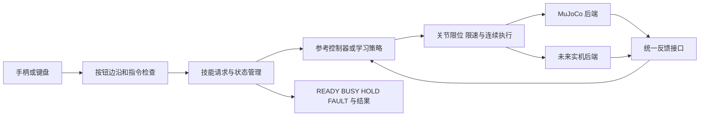
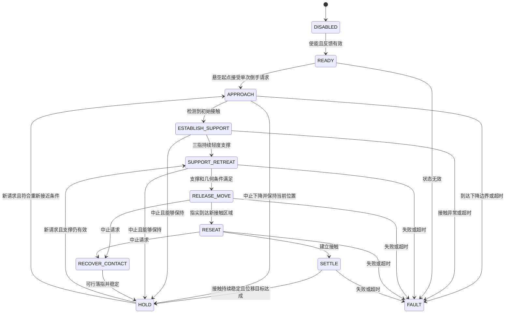

# 独立倒手微技能环境：设计稿

日期：2026-09-18。状态：**设计范围已确认；已有[独立参考原型](regrasp-microskill-reference.md)，阶段 B 部分实现，已建立 Gym 残差环境并训练首轮 PPO，尚未连接真机。**

本稿根据用户最新决定收缩任务：基于 [V1 动作基线](potato-regrasp-v1.md)，另建环境，只训练和执行倒手，不要求切菜。先形成由遥控器几个按钮触发的微技能，再进行 sim2real。此前 [形状适配、抗扰和切菜联动提议](potato-regrasp-rl-sim2real-next.md) 中的切菜载荷、右手和刀不属于第一阶段范围。

已确认任务：**从土豆上方悬空起始，下降并通过接触反馈建立三指支撑，再沿桌面固定方向完成倒手。桌面高度是带误差的参考与下降边界，不是接触成立的依据。** 第一版不使用点云，不向 actor 提供精确土豆形状。

默认交互提议：**按一下完成一次倒手，落稳后自动保持；再按一下才做下一次。** 用户如选择按住连续执行，需要另外确定松开按钮时的落指行为；本稿不把两种语义混在一起。触觉硬件和形状测量设备仍待确认。

## 1. 环境边界

### 包含

- 左机械臂及灵巧手、砧板、自由运动的平底土豆。
- 从限定摆放区域上方的悬空姿态开始，缓慢下降并建立初始扶持，不解决横向搜索或抓取搬运土豆。
- 固定指尖时退腕、三指同步腾空后移、重新接触和按稳。
- 一个带位移目标的倒手请求，结束后可以接受下一请求。
- 相同的技能控制器支持 headless 仿真、交互仿真与将来的实机后端。
- RL 根据可部署反馈调整手形、腕部配合及执行进度；精确几何仅供训练 critic、奖励与评估使用，先建立参考控制器对照。

### 第一阶段不包含

- 右机械臂动作、刀具、下刀节奏、刀跟随、刀手距离奖励、切割断裂。
- “每个接触位置三次下刀/退腕”的切菜循环；默认一次请求只有一次完整支撑退腕和移指。
- 切菜冲击或大外力；先验证无扰动的倒手，之后可在同一环境增加独立的小扰动测试。
- 从任意手姿或任意物体位置自主搜索抓取；起始工作区和接触范围明确限定。
- 真实设备未经核验的触觉、指尖力控制或自由腕部旋转。

土豆自由体和真实接触保留。取消刀任务不等于冻结土豆；不能通过焊接、每步重设物体 qpos 或关闭相关碰撞来制造成功。

## 2. 遥控器控制的是技能，不是关节轨迹



遥控器只发送 `regrasp_once`、`hold/cancel`、启用等离散指令。策略以固定频率读取反馈、输出连续动作。按钮层不依赖 PPO，先接参考控制器即可验证交互；策略替换后无需改变操作者的按键方式。

按钮映射先逻辑定义，实际编号可配置，不假定所有遥控器都与 Xbox 布局一致：

| 逻辑按钮 | 仿真键盘示例 | 行为 |
|---|---|---|
| 倒手一次（例 A） | R | 在 READY/HOLD 且状态有效时，提交一个默认后移 8 mm 的请求 |
| 保持/中止请求（例 B） | H | 支撑阶段平滑停止推进并保持；若指尖腾空，执行可行的受控落指后保持，不继续积累后退目标 |
| 使能/重新确认（例 Start） | E | 仅在反馈有效、工作区条件满足且无未处理故障时允许新动作；不是忽略故障继续走 |
| 重置仿真 | X | 只在仿真 UI 中存在；实机不得把它映射为“瞬间恢复初始姿态” |

第一版不排队：执行中重复按倒手键返回 BUSY，不在动作结束后突然补执行。按键长按只触发一次上升沿；接入遥控器时若按钮已经按住，先等待释放再允许触发。

软件“保持/中止”不是立即松手，也不是冻结物理世界。仿真积分继续，控制器持续执行有界关节目标。若当前没有可行落指路径，进入可解释的 FAULT，不临时猜一个大幅运动。软件按钮不能冒充真实设备的硬件急停。

## 3. 指令和结果契约

拟定接口示意（不是现有可运行 API）：

```text
SkillRequest:
  request_id          唯一请求编号，用于去重
  kind                regrasp_once / hold / enable
  retreat_distance_m  默认 0.008；先只开放已验证范围
  direction_board_xy  第一版固定为砧板坐标 +Y；场景对齐时与 V1 世界 +Y 一致，不随手腕转动
  speed_scale         有界速度参数，第一版可固定
  issued_at / expires_at

SkillStatus:
  request_id
  state               DISABLED / READY / BUSY / HOLD / FAULT
  phase               APPROACH / ESTABLISH_SUPPORT / SUPPORT_RETREAT / RELEASE_MOVE / RESEAT / SETTLE ...
  progress
  outcome             running / succeeded / cancelled / failed
  reason              contact_lost / unreachable / timeout / stale_feedback ...
  measured_support    当前可获得的接触/状态估计
```

遥控层需要去重、拒绝过期请求、拒绝忙时重复请求。手柄读取层可以借鉴当前 `LinuxJoystick` 的设备读法，但不能直接复用其笛卡尔速度 jog 语义。原 reader 对初始化事件、断开及异常的处理要按技能触发重新检查；无按键变化不等于设备断开，不能把“没有新事件”简单当作心跳丢失。

技能输出结果与机器人后端分开。训练环境的一次 episode 可以在一个微技能完成后终止；交互运行器则进入 HOLD，维持同一个物理状态，接受下一请求。**不能为了重复技能，每按一次就 reset 土豆。**

## 4. 一次倒手的状态流程



这张图描述预期外部语义，不意味着训练策略必须收到全部状态真值。

- APPROACH：固定手腕朝向，沿桌面法向缓慢下降；检测接触后转入逐指调整，不下降到一个写死的土豆表面高度。
- ESTABLISH_SUPPORT：先接触的手指减小继续压入，其余手指调整至三指轻度支撑；单指 effort 上升不等于已按稳。
- SUPPORT_RETREAT：指尖保持支撑，腕部沿退手方向运动；保留不拧腕的先验。
- RELEASE_MOVE：食指、中指、无名指同步屈曲腾空并后移，沿连续曲线完成，不人为分成停顿的子动画。
- RESEAT：以展开 PIP/DIP 为主建立新接触；保持适度腕部配合，避免落点后二次蜷指。
- SETTLE：按实际反馈判断是否按稳，超时失败；不能仅靠参考时钟播完判定成功。
- HOLD：动作完成，继续保持支撑并等待新的明确请求。

80°中节角度可作为参考控制器的初始过渡条件，沿用 V1 的已知动作范围；独立 RL 环境不应把某个固定角度永久当成全部形状的唯一最佳触发点。初期可保留保守限制，后续再评估是否由策略在许可范围内调节。

移指时三根主指同时离开、拇指小指移开，物体依赖平底与砧板支撑；本阶段不声称有持续手部力闭合。简化任务后，先验证稳定倒手再讨论该阶段的抗扰能力。

## 5. 独立环境如何复用 V1

新任务不应继承整个 `DynamicRegraspEnv.step()` 再把刀藏起来：旧类包含 CUT_ADVANCE、刀间隙重定向、角度/刀等待、整段三轮时钟和特定观测，容易留下与新任务无关的依赖。

计划复用：

- `PotatoConfig`、网格生成与接触力聚合。
- 左手关节命名、限位、有限力驱动器和 `FingerSolver`。
- 已认可的三指连续后移、DIP 先屈后展、落指小幅退腕的参考曲线。
- 腕部目标固定朝向、关节目标连续衔接的处理经验。
- 实际动力学接触/位移记录和离线回放形式。

需要拆分：

1. 从场景构建中分离“左臂+手+砧板+土豆”，不要求右臂/刀存在。
2. 从 `build_finger_regrasp_preview()` 拆出不带刀 IK、不执行辅助指夹持的左手参考生成器；目前它在函数尾部无条件求刀轨迹，不能直接当独立环境内核。
3. 将土豆形状、位姿、接触区域和单次后退距离变成显式配置，去除固定尺寸/固定世界接触点的假设。
4. 提取不依赖 MuJoCo 的技能请求/状态接口；动力学读写留在后端。
5. 将实机入口与仿真入口分开；仿真包不导入设备 SDK。

V1 行为与回放保留，不把新默认值覆盖旧版。初始录制若仍用于摆位，明确它只提供种子姿态，并把依赖作为显式配置；后续可用已保存的关节种子替代隐含 `latest.npz` 依赖。

拟新增的模块职责，而非承诺已经存在的文件：

| 模块 | 职责 |
|---|---|
| 独立场景构建 | 形状/平底、左手、砧板、可达初始状态 |
| 单次参考生成 | 固定指尖退腕、同步移位、落指 |
| 微技能状态管理 | 请求、去重、busy、完成、中止、超时 |
| Gymnasium 环境 | observation/action/reward、reset/step |
| 仿真运行器 | 实时动力学、按键/手柄、日志和状态可视化 |
| 实机后端（后续） | 同一命令契约下的反馈与有界执行 |

## 6. RL 环境定义

### 6.1 初始范围

从“土豆放在限定区域，手在其上方悬空”开始。手腕朝向固定，倒手方向固定为桌面坐标 +Y；第一版控制腕部沿倒手方向及桌面法向的小幅平移，不开放横向搜索和腕部旋转。首次请求包含下降接触与倒手，后续请求在支撑仍有效时直接继续倒手。

reset 只设置可达、无穿透的悬空初态，不能利用精确表面自动把三指贴好，再声称策略学会了找接触。可以使用形状真值拒绝不可达或起始穿透的样本，但需要记录拒绝率；接触起始的课程训练/消融须单独报告，正式验收从悬空开始。

形状随机化：

- 分别改变整体尺度、长宽高比例及平滑低频不对称形变，得到一端较粗、顶部偏斜、局部较鼓或较平的土豆。
- 保留削平底面；第一版使用不规则凸形，真正凹坑需要后续多凸体碰撞表示，不能只改变渲染网格。
- 每个 episode 采样一次形状，同一物体上连续请求不更换形状。保存种子与参数以复现失败。
- 先验证固定形状，再逐步扩大尺寸、曲率及摆位变化；质量应与体积/密度设定相协调。训练和测试保留不同形状种子。

桌面高度及坐标变换作为可标定但带误差的输入。限制桌面估计误差范围，并结合该误差设置下降边界；接触判定始终依赖实际可用反馈。effort 本身不能可靠区分土豆、桌面和内部阻力，第一版依靠限定摆放区域、物体高度范围及接触发生位置降低歧义；到达下降边界、接触异常或超时则失败，不继续下压。

### 6.2 Observation

执行策略拟使用：

- 左臂和手的关节位置/速度及必要的短时历史。
- 可用的粗触觉或关节 effort 及短时历史；未确认硬件前，不冻结 80 维理想触觉为实机接口。Wuji `joint_effort` 是电流空间中的滤波驱动努力量，不是实测电流，不能直接等同指尖力。候选输入保留三根主指的 12 路 effort，并结合关节目标与实际位置误差；需要实测信号可用性、刷新率和延迟。
- 本次请求的方向、距离和当前技能进度/允许动作状态。
- 上一动作，帮助识别执行滞后和减少抖动。
- 手腕相对桌面的位姿、带误差的桌面高度参考；方向固定，不要求实时形状测量。

第一版 actor 不输入点云、精确土豆尺寸/表面、仿真接触对象身份或物体真值速度。effort 的仿真输入应来自经过标定的驱动输出代理，并模拟噪声、滤波和延迟，不能直接用精确接触力冒充硬件 effort。接口定义参考 [Wuji 官方文档](https://docs.wuji.tech/docs/en/wujihandpy/latest/api-reference/#joint_effort)；实际设备支持情况仍需确认。

不包含右臂关节、刀具状态或切菜阶段。训练 critic/奖励可使用精确土豆状态、接触滑移和摩擦真值，执行 actor 则必须有可部署的输入来源。仿真版成功判断和实机完成判断要分别注明真值/估计来源，不能直接把 MuJoCo 内部接触对象身份或物体速度搬到实机。

### 6.3 Action

遥控按钮不是 PPO action。按钮选技能及目标，PPO 在执行过程中输出有界连续控制。

首个可比较方案：保留参考运动结构，策略输出三指姿态修正、少量腕部平移修正和推进速度。为适应不同形状，动作能力要超出现有三个竖直按压残差；具体选择局部指尖目标或关节协同参数，需按手部可达性和真机接口确定。

优先考虑位置目标接口，与现有 Wuji 工程已有的关节目标发送形式相符；是否支持速度、电流/力矩控制仍需确认。不得把“按压力修正”直接实现成真机不支持的牛顿指令。腕部旋转初期不开放，保留用户已认可的动作形态。

### 6.4 Reward 和终止

核心是“达到要求的后移距离并重新按稳，物体没有被推走”：

- 奖励从悬空状态建立适度三指支撑，随后实际接触区域沿指定方向相对土豆的位移接近目标，以及完成后的持续支撑。倒手位移以初次支撑成立的位置为起点，下降过程不计入倒手进度。
- 惩罚土豆位移、旋转、滑移和过大力；相对目标与物体稳定两者同时检查，避免策略通过移动土豆假装完成倒手。
- 惩罚动作变化、执行器饱和/过大能耗代理和不可达目标。
- 适度时间代价，避免一直保持不动；明确超时终止。
- RELEASE_MOVE 阶段允许三指失去接触，不能全阶段都奖励大接触力，否则策略可能不肯抬指。
- 刀相关奖励与失败判断全部移除。

第一版验收可参考 V1 的 5 mm 物体位移和 60 ms 接触稳定时长，但它们只是待复核的仿真起点，不是实机已标定阈值。成功还需验证真实后移距离；仅参考进度到 1 不够。具体容差随位移指令、传感精度和接触尺度确定。

## 7. 实时交互不是录制视频播放器

当前 V1 窗口先生成整段物理回合，再循环回放。新环境的按钮验证必须在运行中读取事件并推进真实 `mj_step`，否则无法测试请求接受、中止和重复触发。

第一版可先用键盘模拟几个逻辑按钮，再接 Linux 手柄输入。仿真运行器持续积分，状态显示 READY/BUSY/HOLD/FAULT、当前请求、实际后移量、接触和土豆位移。每次请求记录接受/拒绝原因、时刻、结果，不把按钮被按下等同于动作成功。

除训练 episode 的 reset 外，不能在技能请求之间重置机器人/土豆；需要实测连续按三次键的状态连续性。到达物体边缘或手部可达范围末端应拒绝下一请求并说明原因，不能无限后移或自动跳回起点。

## 8. sim2real 的简化路线

1. 先确认真实手的反馈、动作接口、时间戳与更新频率。当前仓库可见关节位置读写，不据此推断已经具备触觉或力矩反馈。
2. 记录同一参考微技能在仿真和真机的关节跟踪，标定增益、延迟、回差、限速与力上限；针对实际不确定性做随机化。
3. 触觉若尚未就绪，可以先验证遥控按钮→参考微技能→位置执行的接口，但该验证不能称为已经迁移触觉 RL。
4. 在相同状态定义下比较落稳成功率、物体位移、落点误差、执行时间和峰值载荷。
5. 单次技能可用后，再测试同一物体上连续多次请求和未见形状。切菜联动留到之后作为技能调用者接入，不重新混入微技能内核。

实机“保持”始终是持续闭环执行，不是暂停物理时间。遥控断开、反馈失效及中止过程要有明确后端行为；其具体动作需按设备和接触情况核验，不能简单照搬仿真冻结时钟。

## 9. 分阶段交付与验收

| 阶段 | 交付 | 通过标准 |
|---|---|---|
| A：本设计 | 环境边界、按钮语义、状态/训练/后端接口 | 不再依赖刀；区分遥控命令与策略 action；标出传感器待确认项 |
| B：参考微技能 | 新场景、单次控制器、实时键盘/手柄运行器 | 首次请求从悬空下降并建立三指支撑；一次按键只执行一次；忙时不排队；完成后保持；三次请求不重置物体；取消与超时可解释 |
| C：训练环境 | 固定形状及受控形状变化、策略接口、基线对照 | 真实动力学、真实落点验收、有限执行器；参考/新策略分开报告 |
| D：RL 微技能 | 新策略及固定测试集结果 | 比较成功率/稳定/落点，而非只看动作播放；失败样本与不可达初始化均记录 |
| E：sim2real | 反馈/执行适配、校准数据、真实对照 | 相同按钮协议在真机调用同一技能语义；真机单独测量成功与误差 |

新测试应覆盖：无刀场景独立构建；不同高度的土豆提前/延后接触；单指接触不误判三指支撑；桌面估计误差与未找到接触时停止下降；悬空中止后保持不冒充有效支撑；动作有界；请求去重/长按边沿/busy；一次完成后 HOLD；三次请求状态连续；中止时指尖腾空的恢复语义；物体速度正常积分；落点和稳定分别检查；设备掉线/过期消息；headless 与交互共用执行逻辑。

当前 A 已记录，B 已有[独立参考原型及验证记录](regrasp-microskill-reference.md)，包括悬空接近、反馈支撑、连续三次倒手和键盘入口；角度触发、真手柄与完整中止验收仍待完成。C/D 已有[首轮 PPO 残差基线](regrasp-rl-baseline.md)，保留参考阶段并学习 8 维控制参数；尚不代表完整阶段验收。E 尚未实现，旧切菜 PPO 未复用。
